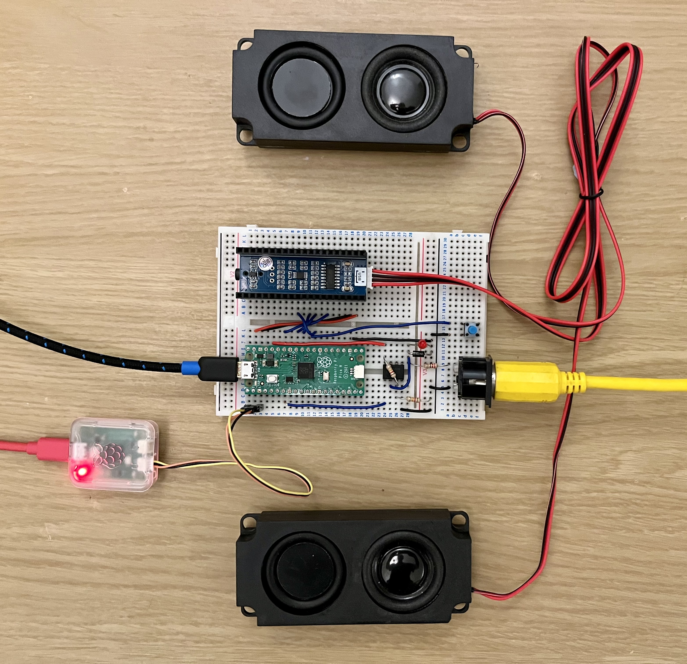

# picoX7

A software simulation of the Yamaha DX7 with a MIDI interface for the Raspberry Pi Pico

Slightly boring [Video](https://www.youtube.com/watch?v=tPLasiQonrg) of the picoX7 playing the Yamaha DX7 ROM cartrdige 1A patches...

## Software dependencies

+ https://github.com/AnotherJohnH/Platform
+ arm-none-eabi-gcc
+ cmake
+ ninja (make works too)
+ SDL2 (for native test target)

Both Pico and native targets should build on MacOS or Linux.

## Hardware information

**NOTE:** The circuit shown above turned out to be a bit noisy see [hardware blog: 13th July 2023](https://github.com/AnotherJohnH/picoX7/wiki/Hardware-Blog#13th-july-2023) for the solution.

+ Currently building for an I2S DAC based around the Cirrus Logic CS4344 from WaveShare
(see below)
Works well but notice Cirrus Logic have discontinued this device. Should be easy to switch
to another I2S DAC
+ ~~The Pico is slightly overclocked to 137.48 MHz to avoid jitter when driving the I2S chip
with a sample frequency of 49100 Hz~~ The Pico is significantly overclocked to 191.08 MHz to
squeeze in 8 voices and generate a jitter free sample rate of 49096 Hz.
+ UART-0 used as a debug console (TX) and alternate MIDIish-IN from the host
+ UART-1 (RX) implements the MIDI-IN interface
+ Two PIO state machines are used to generate I2S and MCLK for the DAC module

|Pin|Peripheral|Allocation|
|---|---|---|
|1|UART-0|Debug console out (UART) TX|
|2|UART-0|Extra MIDI IN (not MIDI baud rate)|
|3|GND|UART GND|
|6|UART-1|MIDI IN|
|28|GND|DAC GND|
|29|PIO|I2S DATA|
|31|PIO|MCLK (for I2S DAC chip)|
|32|PIO|I2S LR CLK|
|33|GND|DAC GND|
|34|PIO|I2S DATA CLK|
|38|GND|DAC GND|
|39|VSYS|DAC VSYS|

### Components

|Name|Description|Source|
|---|---|---|
|Raspberry Pi Pico|DIP module hosting an RP2040 MCU and 2 MiB Flash|[PiHut](https://thepihut.com/products/raspberry-pi-pico?variant=41925332566211)|
|Waveshare Pico Audio|I2S DAC module that directly mounts under the Pico|[PiHut](https://thepihut.com/products/pico-audio-audio-module-for-raspberry-pi-pico-inc-speakers)|
|MIDI controller|Music keyboard with actual MIDI out (not MIDI over USB)|Old Roland PC-200 works for me|
|MIDI-in adapter|An optically isolated 5-pin DIN to UART interface|3 resistors, a diode and an op-amp work well if the controller is battery powered ;-)|
|Reset button|Reset the Pico and allow Flashing|Why not included on the Pico module ?!@#|
|Raspberry Pi Debug probe|Not essential but very helpful|[PiHut](https://thepihut.com/products/raspberry-pi-debug-probe)|

**NOTE** No particular affiliation with PiHut but they have a nice selection and good service

## Status

Incomplete but starting to work.

Done...
   + I2S (via PIO) 16-bit stereo DAC interface at 49096 Hz
   + Basic MIDI in support via UART
   + Voice allocator
   + YM21280 OPS simulation
   + Basic YM21290 EGS simulation
   + DX7 voice patches are starting to sound recognisble

To do, (at least)...
   - Tune EGS simulation
   - Pitch envelope
   - LFO
   - Rate and level scaling
   - Mod and key sensitivity
   - Maybe a logarithmic OPS implementation
   - Optimise to squeeze in more voices
   - Use the 2nd Arm Cortex-M0 (currently idle!)

Limitations...
   + DAC implementation is quite different to the original. Suspect dynamic range is reduced
   + Hitachi 6303 (~MC6803) CPU controller and firmware is not being emulated
   + not using logs for sine amplitude modulation in the OPS => almost certainly not bit accurate
   + [8 voices](https://github.com/AnotherJohnH/picoX7/wiki/Software-Blog#16th-july-2023) (not 16!) - Running on just one arm core at ~85% CPU usage

## How to build

### Checkout

This repo uses git sub-modules, so checkout using --recurse to clone all the
dependent source...

    git clone --recurse https://github.com/AnotherJohnH/picoX7.git

or

    git clone --recurse ssh://git@github.com/AnotherJohnH/picoX7.git

### Build

Being developed on MacOS but should build fine on Linux too.

Indirect build of all supported targets (with cmake and ninja)...

    make

Build directly using cmake...

    mkdir build
    cd build
    cmake -DCMAKE_BUILD_TYPE=Release -DPLT_TARGET=rpipico -DCMAKE_TOOLCHAIN_FILE=Platform/MTL/rpipico/toolchain.cmake ..
    make

Flashable image will be found under the build sub directory here...

    .../Source/picoX7.uf2

## License

This project is licensed under the MIT License - see the [LICENSE](LICENSE) file for details

## Acknowledgements

 + [Ken Shirriff](https://github.com/shirriff) for his very helpful series of [blogs](https://www.righto.com/2021/11/reverse-engineering-yamaha-dx7.html) reverse engineering the YM21280
 + [AJXS](https://github.com/ajxs) for their annotated [disassembly](https://ajxs.me/blog/Yamaha_DX7_Firmware_ROM_Disassembly.html) of the DX7 firmware ROM
 + The [Dexed](https://asb2m10.github.io/dexed) developers for providing an easily accessible DX7 audio reference
 + The raspberry-pi foundation for the innovative [RP2040](https://www.raspberrypi.com/documentation/microcontrollers/rp2040.html)
 + The engineers at [Yamaha](https://www.yamaha.com/en/ir/publications/pdf/an-2022-point01e.pdf)
