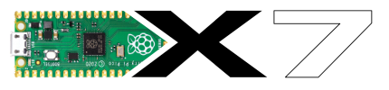
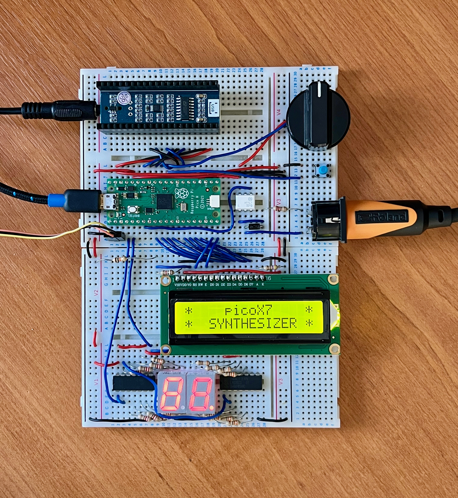

# picoX7

A software simulation of the Yamaha DX7 with a MIDI interface for the Raspberry Pi Pico

Slightly boring [video](https://www.youtube.com/watch?v=7_5bl6q7xVs) of the picoX7 playing the Yamaha DX7 ROM cartrdige 1A patches...

## Software dependencies

+ https://github.com/AnotherJohnH/Platform
+ arm-none-eabi-gcc
+ cmake
+ ninja (make works too)
+ SDL2 (only for native test target)

Both Pico and native targets should build on MacOS or Linux.

## Hardware information

For more information on the circuit above see  the [schematic](https://github.com/AnotherJohnH/picoX7/blob/main/docs/schematic_v0.05.pdf) and the [hardware blog](https://github.com/AnotherJohnH/picoX7/wiki/Hardware-Blog)

+ Currently building for an I2S DAC based around the Cirrus Logic CS4344 from WaveShare
(see below)
Works well but notice Cirrus Logic have discontinued this device. Should be easy to switch
to another I2S DAC
+ The Pico is significantly overclocked to 191.08 MHz to support 8 voices and generate a jitter free sample rate of 49096 Hz.
+ UART-0 used as a debug console  (115200 baud)
+ UART-1 (RX) implements the physical MIDI-IN interface
+ Two PIO state machines are used to generate I2S and MCLK for the DAC module

|Pin|Peripheral|Allocation|
|---|---|---|
|1|UART-0|Debug console out (UART) TX|
|2|UART-0|Debug console in (UART) RX|
|3|GND|UART GND|
|6|UART-1|MIDI IN|
|19|I2C1|SDA (for I2C LCD)|
|20|I2C1|SCL (for I2C LCD)|
|29|PIO|I2S DATA|
|31|PIO|MCLK (for I2S DAC chip)|
|32|PIO|I2S LR CLK|
|34|PIO|I2S DATA CLK|

### Alternative hardware targets

Software builds for the following hardware targets...
+ WAVESHARE_GPIO_LCD - The hardware described above
+ WAVESHARE_I2C_LCD  - Use an I2C LCD on pins 19+20 instead of the 8-bit parallel interface
+ PIMORONI_PICO_AUDIO - Use the Pimoroni Pico Audio I2S DAC instead (also uses the I2C LCD)
+ PWM_DAC - DAC implemented using the on-chip PWM and a few external resistors and capacitors on pins 21 and 22 (sound quality is not great) 
+ PIMORONI_VGA_DEMO - Support for the Pimoroni Pico VGA Demo Base (!!!! untested !!!!)

NOTE: The LCD and LED displays are optional and will not block operation if not fitted

In addition all the above targets are built for and work with RP2350 Picos as well as the older RP2040 Picos. 

### Components

|Name|Description|Source|
|---|---|---|
|Raspberry Pi Pico|DIP module hosting an RP2040 MCU and 2 MiB Flash|[PiHut](https://thepihut.com/products/raspberry-pi-pico?variant=41925332566211)|
|Waveshare Pico Audio|I2S DAC module that directly mounts under the Pico|[PiHut](https://thepihut.com/products/pico-audio-audio-module-for-raspberry-pi-pico-inc-speakers)|
|MIDI controller|Music keyboard with actual MIDI out (MIDI over the USB connector also works)|Old Roland PC-200 works for me|
|MIDI-in adapter|An optically isolated 5-pin DIN to UART interface|3 resistors, a diode and an op-amp work well if the controller is battery powered ;-)|
|Reset button|Reset the Pico and allow Flashing|Why not included on the Pico module ?!@#|
|16x2 I2C LCD|Optional voice name display|[PiHut](https://thepihut.com/products/lcd1602-i2c-module)|
|Raspberry Pi Debug probe|Not essential but very helpful|[PiHut](https://thepihut.com/products/raspberry-pi-debug-probe)|

**NOTE** No particular affiliation with PiHut but they have a nice selection and excellent service

## Status

Incomplete but starting to work.

Done...
   + I2S (via PIO) 16-bit stereo DAC interface at 49096 Hz
   + Basic MIDI in support via UART and USB
   + Voice allocator
   + YM21280 OPS simulation
   + Basic YM21290 EGS simulation
   + DX7 voice patches are starting to sound recognisble
   + Use the 2nd Arm Cortex-M0

To do, (at least)...
   - Tune EGS simulation
   - Pitch envelope
   - LFO
   - Rate and level scaling
   - Mod and key sensitivity
   - Maybe a logarithmic OPS implementation
   - Optimise to squeeze in more voices

Limitations...
   + DAC implementation is quite different to the original. Suspect dynamic range is reduced
   + Hitachi 6303 (~MC6803) CPU controller and firmware is not being emulated
   + not using logs for sine amplitude modulation in the OPS => almost certainly not bit accurate
   + [8 voices](https://github.com/AnotherJohnH/picoX7/wiki/Software-Blog#16th-july-2023) (not 16!) - Running on two arm cores at ~85% CPU usage

See the [software blog](https://github.com/AnotherJohnH/picoX7/wiki/Software-Blog) and [hardware blog](https://github.com/AnotherJohnH/picoX7/wiki/Hardware-Blog)  for more detailed progress updates.

## How to build

### Checkout

This repo uses git sub-modules, so checkout using --recurse to clone all the
dependent source...

    git clone --recurse https://github.com/AnotherJohnH/picoX7.git

or

    git clone --recurse ssh://git@github.com/AnotherJohnH/picoX7.git

### Build

Being developed on MacOS but should build fine on Linux too.

Indirect build of all supported targets (with cmake and ninja)...

    make

Build directly using cmake...

    mkdir build
    cd build
    cmake -DCMAKE_BUILD_TYPE=Release -DPLT_TARGET=rpipico -DCMAKE_TOOLCHAIN_FILE=Platform/MTL/rpipico/toolchain.cmake ..
    cmake -DCMAKE_BUILD_TYPE=Release -DPLT_TARGET=native ..
    make

Flashable image will be found under the build sub directory here...

    .../Source/picoX7_WAVESHARE_GPIO_LCD.uf2
    .../Source/picoX7_WAVESHARE_I2C_LCD.uf2
    .../Source/picoX7_PIMORONI_VGA_DEMO.uf2

## License

This project is licensed under the MIT License - see the [LICENSE](LICENSE) file for details

## Acknowledgements

 + [Ken Shirriff](https://github.com/shirriff) for his very helpful series of [blogs](https://www.righto.com/2021/11/reverse-engineering-yamaha-dx7.html) reverse engineering the YM21280
 + [AJXS](https://github.com/ajxs) for their annotated [disassembly](https://ajxs.me/blog/Yamaha_DX7_Firmware_ROM_Disassembly.html) of the DX7 firmware ROM
 + The [Dexed](https://asb2m10.github.io/dexed) developers for providing an easily accessible DX7 audio reference
 + The raspberry-pi foundation for the innovative [RP2040](https://www.raspberrypi.com/documentation/microcontrollers/rp2040.html)
 + The engineers at [Yamaha](https://www.yamaha.com/en/about/design/synapses/id_009)
